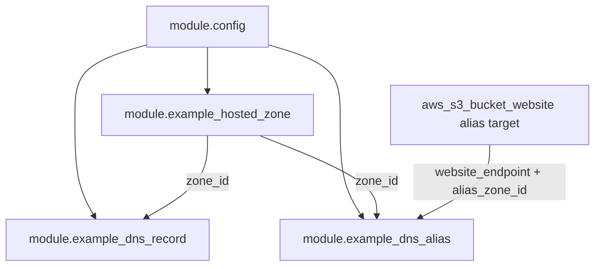

# DNS Module Examples Plan

**Date:** 2026-07-03  
**Generated by:** Composer  
**Status:** Implemented

This document captures the plan for adding example implementations of the `hosted_zone`, `dns_record`, and `dns_alias` Terraform modules from the [deps](https://github.com/agent-0028/deps) repository.

All deps references point at **`main`**.

## Goal

Add idiomatic example usage for the DNS modules in this repo, with prod and nonprod sets of Terraform scripts, following the pattern established in [`terraform/nonprod/example-bucket.tf`](../terraform/nonprod/example-bucket.tf).

The `config` module is already used throughout via `module.config` in each environment's `main.tf` and does not need a separate example.

## Reference pattern: `example-bucket.tf`

```hcl
module "example_bucket" {
  source = "git::https://github.com/agent-0028/deps.git//terraform/modules/bucket?ref=main"
  attributes = {
    bucket : "deps-examples-bucket"
  }
  env-suffix = module.config.env-suffix
  env        = module.config.env
  repo       = module.config.repo
}
```

Key conventions:

- One file per module example
- Git module source: `git::https://github.com/agent-0028/deps.git//terraform/modules/<name>?ref=main`
- Callers pass **base names**; modules apply `env-suffix` internally
- Standard wiring from `module.config`: `env`, `env-suffix`, and `repo` (where the module accepts it)
- Identical example files in both `terraform/prod/` and `terraform/nonprod/`; environment differences come from `module.config` in each directory's `main.tf`

No changes to `main.tf`, GitHub Actions workflows, or the config module are expected — CI already runs `tofu plan`/`apply` against all `.tf` files in each env directory.

## env-suffix behavior (deps `main`)

The `config` module provides `env-suffix`:

- **prod:** `""` (empty string)
- **nonprod:** `"-nonprod"`

All resource modules (`bucket`, `hosted_zone`, `dns_record`, `dns_alias`) now apply it internally. DNS modules use the same logic:

```hcl
locals {
  name_parts = split(".", var.name)

  env_qualified_name = (
    var.env-suffix != "" && length(local.name_parts) > 1
    ? "${local.name_parts[0]}${var.env-suffix}.${join(".", slice(local.name_parts, 1, length(local.name_parts)))}"
    : var.name
  )
}
```

**Rules:**

| Input shape | nonprod result | Notes |
|-------------|----------------|-------|
| `deps-examples.sproutlandscapedesign.com` | `deps-examples-nonprod.sproutlandscapedesign.com` | Suffix inserted after the **first label** — use for zone apex names |
| `verify` (single label) | `verify` (unchanged) | Use for records **inside** an already-suffixed zone |
| `www` (single label) | `www` (unchanged) | Resolves to `www.deps-examples-nonprod.sproutlandscapedesign.com` when zone is suffixed |
| `verify.deps-examples.sproutlandscapedesign.com` | `verify-nonprod.deps-examples.sproutlandscapedesign.com` | Suffix on first label only — **not** the zone apex; avoid for in-zone records |

**Call-site guidance:**

- **`hosted_zone`:** pass the base apex FQDN (e.g. `deps-examples.sproutlandscapedesign.com`); module produces the env-qualified zone name.
- **`dns_record` / `dns_alias`:** pass a **short, single-label name** (e.g. `verify`, `www`) so the record lands in the correct zone without double-suffixing or suffixing the wrong label.

The `hosted_zone` module also exports `qualified_name` (the final zone name after suffixing).

`env-suffix` no longer has a default on DNS modules — callers must pass `module.config.env-suffix` explicitly (same as bucket).

## Module interfaces (from deps)

| Module        | Required inputs                                              | Key outputs                          |
|---------------|--------------------------------------------------------------|--------------------------------------|
| `hosted_zone` | `name`, `repo`, `env`, `env-suffix`                          | `id`, `qualified_name`, `dns_records`, `soa_dns_records` |
| `dns_record`  | `name`, `type`, `records`, `zone_id`, `ttl`, `env`, `env-suffix` | (none)                           |
| `dns_alias`   | `name`, `zone_id`, `value`, `alias_zone_id`, `env`, `env-suffix` | (none)                           |

## Proposed file layout

Add six files (three per environment, identical content):

```
terraform/nonprod/
  example-hosted-zone.tf   # new
  example-dns-record.tf    # new
  example-dns-alias.tf     # new
terraform/prod/
  example-hosted-zone.tf   # new (same as nonprod)
  example-dns-record.tf    # new
  example-dns-alias.tf     # new
```



## Proposed file contents

### 1. `example-hosted-zone.tf`

Creates the Route53 hosted zone that the other two examples depend on.

```hcl
module "example_hosted_zone" {
  source = "git::https://github.com/agent-0028/deps.git//terraform/modules/hosted_zone?ref=main"

  name       = "deps-examples.sproutlandscapedesign.com"
  env-suffix = module.config.env-suffix
  env        = module.config.env
  repo       = module.config.repo
}
```

Resulting zone names:

- **nonprod:** `deps-examples-nonprod.sproutlandscapedesign.com`
- **prod:** `deps-examples.sproutlandscapedesign.com`

### 2. `example-dns-record.tf`

Adds a simple TXT record inside the hosted zone. Uses a single-label `name` so the module does not re-suffix the wrong label.

```hcl
module "example_dns_record" {
  source = "git::https://github.com/agent-0028/deps.git//terraform/modules/dns_record?ref=main"

  name       = "verify"
  type       = "TXT"
  records    = ["deps-examples-dns-record-example"]
  ttl        = 300
  zone_id    = module.example_hosted_zone.id
  env-suffix = module.config.env-suffix
  env        = module.config.env
}
```

Resulting record FQDNs:

- **nonprod:** `verify.deps-examples-nonprod.sproutlandscapedesign.com`
- **prod:** `verify.deps-examples.sproutlandscapedesign.com`

### 3. `example-dns-alias.tf`

Uses a **standalone** minimal S3 static website bucket (raw `aws_*` resources, not the bucket module) plus the `dns_alias` module pointing at it. Keeps `example-bucket.tf` unchanged.

Resources in this file:

1. `aws_s3_bucket` — name `deps-examples-dns-alias${module.config.env-suffix}` (raw resource; suffix applied manually)
2. `aws_s3_bucket_website_configuration` — index document suffix `index.html`
3. `aws_s3_bucket_public_access_block` — allow public website access
4. `aws_s3_bucket_policy` — minimal public read policy for the website endpoint
5. `module.example_dns_alias` — A-record alias to the S3 website endpoint

```hcl
module "example_dns_alias" {
  source = "git::https://github.com/agent-0028/deps.git//terraform/modules/dns_alias?ref=main"

  name                   = "www"
  zone_id                = module.example_hosted_zone.id
  value                  = aws_s3_bucket_website_configuration.dns_alias_target.website_endpoint
  alias_zone_id          = "Z3BJ6K6RIHEN7M" # S3 website hosted zone ID for us-west-2
  evaluate_target_health = false
  env-suffix             = module.config.env-suffix
  env                    = module.config.env
}
```

Resulting alias FQDNs:

- **nonprod:** `www.deps-examples-nonprod.sproutlandscapedesign.com`
- **prod:** `www.deps-examples.sproutlandscapedesign.com`

The hardcoded `alias_zone_id` is the [documented AWS constant](https://docs.aws.amazon.com/general/latest/gr/s3.html) for S3 website endpoints in `us-west-2` (matches the backend region in `main.tf`). Add a comment in the file noting it is region-specific.

## Verification steps

1. Run `tofu fmt -recursive terraform/` to format all new files.
2. Re-init to pick up the new module ref:
   ```bash
   cd terraform/nonprod && tofu init -upgrade && tofu workspace select --or-create dev && tofu plan
   cd terraform/prod && tofu init -upgrade && tofu workspace select default && tofu plan
   ```
3. Confirm plan shows:
   - 1 Route53 zone
   - 1 TXT record + 1 A alias record
   - 1 S3 bucket + website config + policy (dns_alias target only)
   - No unexpected changes to existing `example_bucket` resources
4. After merge, run the existing GitHub Actions check/deploy workflows for nonprod first, then prod.

## Cost and operational notes

- Each hosted zone costs ~$0.50/month while it exists; destroy workflows will remove it.
- Route53 public zones for `example.com` and its subdomains are **reserved by AWS** and cannot be created.
- Zone apex is `deps-examples.sproutlandscapedesign.com` — a subdomain of `sproutlandscapedesign.com`, whose apex zone is managed in `tinisi/infra`. For public resolution, delegate NS records from the parent zone.
- Zones will not resolve publicly until NS records are delegated — acceptable for an examples repo focused on module usage, not live DNS.
- The standalone S3 website bucket is separate from the state bucket and the example bucket; all three can coexist with distinct names.

## Out of scope

- No separate example for `config` (already used in `main.tf`)
- No README changes (existing CI covers new `.tf` files automatically)

## Implementation todos

- [x] Update DNS modules in `deps` to apply `env-suffix` internally
- [x] Revert all deps references back to `main`
- [x] Revise example `name` values to use base names / single-label record names
- [x] Create `example-hosted-zone.tf` in `terraform/nonprod` and `terraform/prod`
- [x] Create `example-dns-record.tf` wired to `module.example_hosted_zone.id` in both env dirs
- [x] Create `example-dns-alias.tf` with standalone S3 website bucket + `dns_alias` module in both env dirs
- [x] Run `tofu fmt` and `tofu plan` in nonprod and prod to smoke-test
