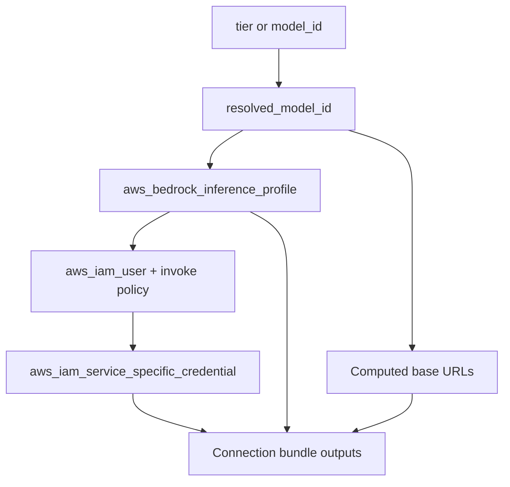

# Bedrock Inference Module (`bedrock_inference`)

**Date:** 2026-07-31  
**Generated by:** Composer

Module plan for provisioning a Bedrock-backed LLM connection bundle: tier-based model selection, optional explicit `model_id`, Bedrock API key, and OpenAI-compatible endpoint outputs for Pi and other coding agents.

**Development workflow:** follow [PLAN-local-first-module-development.md](PLAN-local-first-module-development.md) (local spike → promote to deps → CI → human apply).

---

## Implementation checklist

- [ ] **Phase 1:** Branch in deps-examples; create `terraform/modules/bedrock_inference/` + `tests/`; add `example-bedrock-inference.tf` (nonprod + prod); green `tofu test`
- [ ] **Phase 2:** Copy module to `deps/terraform/modules/bedrock_inference/`; validate + test; push deps feature branch
- [ ] **Phase 3:** Pin examples to deps branch; remove local module; Check Infra nonprod green
- [ ] **Phase 4:** Merge both PRs; human Deploy Infra nonprod; verify Pi/curl invoke; optional Destroy
- [ ] **Phase 5:** Document bedrock module usage in AGENTS.md (after workflow doc from first cycle)

---

## Goal

Wire up the smallest set of AWS resources so a caller can specify a **model tier** (or explicit inference profile ID) and get back a ready-to-use **connection bundle**: base URL + model ID + Bedrock API key.

Target use cases:

- [Pi](https://github.com/earendil-works/pi) coding agent (`amazon-bedrock` provider or OpenAI-compatible custom provider)
- OpenAI SDK clients pointed at Bedrock Chat Completions (OpenRouter-style shape)
- Future `llm_endpoint` router module (switches Bedrock vs LM Studio by env/flag)

---

## What Terraform actually provisions

Bedrock does **not** expose a per-customer HTTP server like OpenRouter. The OpenAI-compatible endpoint already exists as a regional AWS service URL:

| Endpoint | Base URL (OpenAI Chat Completions) | Auth |
|----------|-----------------------------------|------|
| **bedrock-mantle** (recommended) | `https://bedrock-mantle.{region}.api.aws/v1` | Bedrock API key or AWS creds |
| **bedrock-runtime** | `https://bedrock-runtime.{region}.amazonaws.com/v1` | Bearer token or SigV4 |

The module **computes** these URLs and creates supporting AWS resources (inference profile, IAM, API key). It does not create load balancers, API Gateway, or custom proxies.

This is simpler than the [OpenCode-on-Bedrock sample](https://github.com/aws-samples/sample-opencode-with-bedrock), which runs a custom ECS router to translate OpenAI → Converse.



---

## Environment

- **AWS provider:** `hashicorp/aws` **6.53.0** ([terraform/prod/.terraform.lock.hcl](../terraform/prod/.terraform.lock.hcl))
- **Default region:** `us-west-2` ([deps config module](../deps/terraform/modules/config/variables.tf))

| Terraform resource | Purpose |
|--------------------|---------|
| [aws_bedrock_inference_profile](https://registry.terraform.io/providers/hashicorp/aws/6.53.0/docs/resources/bedrock_inference_profile) | Application inference profile for cost/tags |
| [aws_iam_service_specific_credential](https://registry.terraform.io/providers/hashicorp/aws/6.53.0/docs/resources/iam_service_specific_credential) | Bedrock API key (`service_name = "bedrock.amazonaws.com"`) |
| `aws_iam_user` + `aws_iam_user_policy` | Scoped `bedrock:InvokeModel*` on inference profile ARNs |

**Not needed for v1:** Model access enablement for serverless foundation models ([AWS security blog](https://aws.amazon.com/blogs/security/simplified-amazon-bedrock-model-access/)). Marketplace models would need `aws_bedrock_foundation_model_agreement` — defer.

**Out of scope for v1:** Provisioned throughput, custom ECS/OpenAI proxy, Bedrock Agents, SageMaker endpoints, SSM/Secrets Manager key delivery.

---

## Module interface (v1)

**Location:** `terraform/modules/bedrock_inference/`

**File layout:**

```
bedrock_inference/
├── main.tf              # variables, validations, standard deps inputs
├── tiers.tf             # tier → model_id map (maintenance surface)
├── bedrock_inference.tf # resources + outputs
└── tests/
    └── bedrock_inference.tftest.hcl
```

### Inputs

**Model selection — tier or explicit model_id (mutually exclusive):**

```hcl
variable "attributes" {
  type = object({
    tier     = optional(string) # "fast" | "balanced" | "capable"
    model_id = optional(string) # geo inference profile ID
  })

  validation {
    condition     = (var.attributes.tier != null) != (var.attributes.model_id != null)
    error_message = "Set exactly one of attributes.tier or attributes.model_id."
  }

  validation {
    condition = (
      var.attributes.tier == null ||
      contains(["fast", "balanced", "capable"], var.attributes.tier)
    )
    error_message = "attributes.tier must be fast, balanced, or capable."
  }

  validation {
    condition = (
      var.attributes.model_id == null ||
      can(regex("^(us|eu|global|jp|au)\\.", var.attributes.model_id))
    )
    error_message = "attributes.model_id must be a geo or global inference profile ID."
  }
}
```

**Resolution:**

```hcl
resolved_model_id = coalesce(
  var.attributes.model_id,
  local.tier_models[var.attributes.tier]
)
```

**Standard deps inputs:** `env`, `env-suffix`, `repo`, optional `aws_region`.

**Flags:**

```hcl
create_api_key = true             # default — IAM user + Bedrock API key + invoke policy
create_application_profile = true
api_key_age_days = null         # optional expiry (e.g. 90); null = no expiry
```

`create_api_key = false` skips IAM (escape hatch only).

### Tier enum: stable API, mutable mapping

| What stays stable | What changes over time |
|-------------------|------------------------|
| `tier = "fast" \| "balanced" \| "capable"` | Inference profile IDs in `tiers.tf` |
| Consumer `.tf` files | Module-only map updates when AWS ships new models |
| Semantic meaning (cheap / daily / heavy) | Which Claude version fulfills each tier |
| `model_id` escape hatch | Caller-owned; no tier map update needed |

**When AWS releases a new model for a tier:**

1. Update `tiers.tf` in the module (deps after promotion).
2. Update `tofu test` asserts if they pin exact model ID strings.
3. Check Infra → Deploy nonprod → verify invoke.

Consumers using `tier` need no changes. Adding a new tier value (e.g. `"frontier"`) is a deliberate interface extension.

**v1 tier map (us-west-2, geo prefix `us.`):**

| Tier | Intent | System inference profile ID |
|------|--------|------------------------------|
| `fast` | Cheap/quick (Haiku) | `us.anthropic.claude-haiku-4-5-20251001-v1:0` |
| `balanced` | Daily coding (Sonnet) | `us.anthropic.claude-sonnet-4-6` |
| `capable` | Heavier reasoning (Opus) | `us.anthropic.claude-opus-4-6-v1` (confirm at apply) |

Use **geo inference profile IDs** (`us.*`), not bare foundation model IDs — avoids 403/SCP issues.

**Try a new model before updating the tier map:**

```hcl
attributes = { model_id = "us.anthropic.claude-sonnet-4-7" }  # hypothetical
```

### Outputs — connection bundle

| Output | Description |
|--------|-------------|
| `model_id` | Resolved inference profile ID (for `--model` or API) |
| `tier` | Echo when tier was used; null when `model_id` was used |
| `openai_base_url` | `https://bedrock-runtime.{region}.amazonaws.com/v1` |
| `openai_mantle_base_url` | `https://bedrock-mantle.{region}.api.aws/v1` |
| `region` | AWS region |
| `inference_profile_arn` | Application inference profile ARN |
| `api_key` | Bedrock bearer token (sensitive) → `AWS_BEARER_TOKEN_BEDROCK` |
| `iam_user_name` | Ops/debugging |
| `pi_env` | Shell-ready export block (sensitive) |
| `pi_command` | `pi --provider amazon-bedrock --model ...` |

Future router modules should re-export a subset: `model_id`, `openai_base_url`, `api_key`, `tier`, `backend`.

---

## API key resources (default on)

Per module instance:

| Resource | Naming | Notes |
|----------|--------|-------|
| `aws_iam_user` | `bedrock-inference{env-suffix}-...` | One user per module instance |
| `aws_iam_user_policy` | invoke policy | Application + system inference profile ARNs |
| `aws_iam_service_specific_credential` | Bedrock API key | `service_name = "bedrock.amazonaws.com"` |

**ARN construction:**

```hcl
system_inference_profile_arn = "arn:aws:bedrock:${region}:${account_id}:inference-profile/${local.resolved_model_id}"
```

Application profile `model_source.copy_from` points at this system inference profile ARN.

**IAM policy (v1, least privilege):**

- `bedrock:InvokeModel`, `bedrock:InvokeModelWithResponseStream` on:
  - Application inference profile ARN
  - System inference profile ARN for resolved model
- Broaden only if apply testing shows geo profiles require it

**Secret lifecycle:**

1. `service_credential_secret` available only at create — stored in Terraform state (S3 backend).
2. After Deploy: human runs `tofu output -raw api_key` once locally.
3. Never log in CI.
4. Rotation: change `api_key_age_days` or taint credential resource.
5. Destroy: IAM user + key removed with module.

---

## Agent integration

### Pi — native Bedrock provider

```bash
export AWS_BEARER_TOKEN_BEDROCK=$(tofu output -raw api_key)
export AWS_REGION=$(tofu output -raw region)
pi --provider amazon-bedrock --model $(tofu output -raw model_id)
```

See [Pi providers docs](https://github.com/earendil-works/pi/blob/main/packages/coding-agent/docs/providers.md).

### OpenAI-compatible clients (OpenRouter-style)

```python
from openai import OpenAI
client = OpenAI(
    base_url="https://bedrock-runtime.us-west-2.amazonaws.com/v1",
    api_key=os.environ["AWS_BEARER_TOKEN_BEDROCK"],
)
client.chat.completions.create(
    model="us.anthropic.claude-sonnet-4-6",
    messages=[{"role": "user", "content": "ping"}],
)
```

Pi can also use a custom provider in `models.json` with the same base URL + key shape.

### Post-deploy verification (human gate)

```bash
cd terraform/nonprod
tofu output -raw api_key | wc -c    # confirm non-empty; do not print value

export AWS_BEARER_TOKEN_BEDROCK=$(tofu output -raw api_key)
export AWS_REGION=$(tofu output -raw region)
pi --provider amazon-bedrock --model $(tofu output -raw model_id)
```

Or curl:

```bash
curl -s "https://bedrock-runtime.us-west-2.amazonaws.com/v1/chat/completions" \
  -H "Authorization: Bearer $(tofu output -raw api_key)" \
  -H "Content-Type: application/json" \
  -d '{"model":"'"$(tofu output -raw model_id)"'","messages":[{"role":"user","content":"ping"}]}'
```

---

## Example consumer (deps-examples)

**Nonprod** — `tier = "fast"` (lower inference cost during dev):

```hcl
module "example_bedrock_inference" {
  source     = "../modules/bedrock_inference"
  attributes = { tier = "fast" }
  env-suffix = module.config.env-suffix
  env        = module.config.env
  repo       = module.config.repo
}
```

**Prod** — `tier = "balanced"`.

Forward module outputs at the stack level (mark `api_key` and `pi_env` sensitive) for post-deploy retrieval.

---

## `tofu test` cases

All plan + `mock_provider "aws"` — AFK-safe, no AWS creds:

- `fast`, `balanced`, `capable` → correct `model_id` from tier map
- Explicit `model_id` → output matches input; `tier` is null
- Both tier and model_id set / neither set → validation fails at plan
- Invalid tier or bare foundation `model_id` (no geo prefix) → validation fails
- prod vs nonprod → tags include `Environment`; IAM user name includes `env-suffix`
- `openai_base_url` contains configured region
- `create_api_key = true` → plan includes IAM user + service credential (mocked)
- `create_api_key = false` → no IAM user in plan

---

## Risks at apply

1. **Opus tier availability** in us-west-2 — verify model card; adjust `tiers.tf` if needed.
2. **API key in state** — accepted for v1; retrieve via output after deploy; do not commit or log.
3. **IAM invoke scope** — may need policy tuning after first real invoke.
4. **Inference cost** — accrues during human verification (Pi/curl), not from IAM/profile resources alone.
5. **OpenRouter literal compatibility** — this module targets OpenAI Chat Completions shape on Bedrock, not OpenRouter routing headers or multi-vendor catalog.

---

## v1 scope boundary

**In:**

- Tier enum + `model_id` XOR
- Tier map maintenance contract (`tiers.tf`)
- Application inference profile
- Bedrock API key (default on) + IAM invoke policy
- OpenAI-compatible URL outputs + Pi env/command outputs
- `tofu test` suite (lifts to deps with module)

**Later:**

- SSM/Secrets Manager for out-of-band key delivery
- Marketplace model agreements
- Provisioned throughput
- CI job running `tofu test` on changed modules
- Automatic key rotation workflow

---

## Future modules (separate plans)

Architectural compatibility — not part of this module's v1:

| Future module | Role | Shared contract |
|---------------|------|-----------------|
| `lm_studio` | SSH/CLI provisioning of local LM Studio endpoint | Same `tier` / `model_id` attribute shape; different tier map |
| `llm_endpoint` | Router: Bedrock vs LM Studio by env or flag | Re-exports `model_id`, `openai_base_url`, `api_key`, `tier`, `backend` |

The `tier` enum is **backend-agnostic semantics** (cheap / daily / heavy). Bedrock-specific resources stay inside `bedrock_inference`; LM Studio jank stays inside `lm_studio`.
