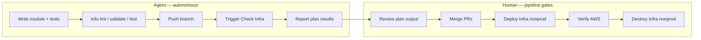
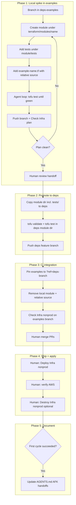

# Local-First Terraform Module Development

**Date:** 2026-07-31  
**Generated by:** Composer

Strategy for prototyping Terraform modules in this repo, promoting them to [deps](../deps), and validating them through CI before human-gated apply.

**Module-specific plans:** see [PLAN-bedrock-inference-module.md](PLAN-bedrock-inference-module.md) for the first module (`bedrock_inference`).

---

## Implementation checklist (generic)

- [ ] **Phase 1:** Create deps-examples branch; add `terraform/modules/<name>/` (with `tests/`) + `example-<name>.tf`; iterate with `tofu test`
- [ ] **Phase 2:** Copy module directory (including tests) to `deps/terraform/modules/<name>/`; `fmt`, `validate`, `test`; push deps feature branch
- [ ] **Phase 3:** Swap examples to git `?ref=<deps-branch>`; remove local module; run Check Infra nonprod on feature branch
- [ ] **Phase 4:** Merge deps; revert pins to `main`; merge examples; human runs Deploy Infra nonprod (optional Destroy)
- [ ] **Phase 5:** After first successful cycle, update [AGENTS.md](../AGENTS.md) and [deps/AGENTS.md](../deps/AGENTS.md) with local-first workflow and AFK agent handoffs

---

## Verdict: workflow is reasonable

The two-repo split is already designed for this:

- **[deps](../deps)** — library code only (no backend, no apply). [AGENTS.md](../deps/AGENTS.md) limits local testing to `tofu validate`.
- **deps-examples** (this repo) — deployable root stacks with AWS backend, nonprod/prod envs, and six manual GitHub Actions workflows.

Starting in examples for a tight local loop is not documented today, but it fits the repo layout and avoids a cross-repo push on every iteration. The placeholder [terraform/modules/.gitkeep](../terraform/modules/.gitkeep) suggests this was anticipated.

The established workflow (deps branch pin → Check Infra on a feature branch) remains the right path for CI integration and promotion — already exercised for DNS env-suffix work (commits `b671823` → `e6cbcff`).

---

## AFK agent workflow vs human pipeline gates

This plan mirrors application-development CI: **automate everything that does not mutate production state**, and **gate apply behind a pipeline the human triggers**.



### What the agent can run without you (AFK-safe)

| Step | Command / action | Mutates AWS? | Needs local creds? |
|------|------------------|--------------|-------------------|
| Format | `tofu fmt -recursive` | No | No |
| Module smoke | `tofu validate` | No | No |
| Interface tests | `tofu test` (plan + mocks) | No | No |
| Push branch | `git push` | No | No |
| CI plan | **Check Infra nonprod/prod** via `gh workflow run` | No (plan only) | No — CI has GitHub env secrets |

The agent inner loop during Phase 1 is **`tofu test` → edit → repeat**. No AWS, no push required until the interface stabilizes.

For stack-level verification, the agent pushes the feature branch and triggers Check Infra:

```bash
gh workflow run check-infra-nonprod.yml --ref <feature-branch>
gh run watch
```

Check Infra runs `tofu plan` against real remote state and AWS — the integration test — without apply.

**Optional:** Local `tofu plan` in nonprod if the agent environment has AWS creds. Not required for AFK; CI plan is the canonical integration check per [AGENTS.md](../AGENTS.md).

### What stays human-gated (pipeline apply)

| Step | Workflow | When | Why human |
|------|----------|------|-----------|
| Apply nonprod | **Deploy Infra nonprod** | After merge to `main` | Creates/modifies AWS resources |
| Tear down nonprod | **Destroy Infra nonprod** | End of test cycle | Destructive |
| Apply prod | **Deploy Infra prod** | After merge to `main` | Long-lived prod resources |
| PR merge | GitHub review | Before deploy | Code review gate |

Deploy runs plan then apply in one job ([deploy-infra-nonprod.yml](../.github/workflows/deploy-infra-nonprod.yml)).

**Agent stops and hands off** with: branch pushed, Check Infra green, plan summary attached to PR or chat.

### Feedback loop mapping (app dev → infra)

| App development | This workflow |
|-----------------|---------------|
| Unit tests | `tofu test` with mocks in `tests/` |
| Lint / typecheck | `tofu fmt --check`, `tofu validate` |
| CI integration tests | Check Infra (plan only, feature branch) |
| Staging deploy | Deploy Infra nonprod (human-triggered, from `main`) |
| Prod deploy | Deploy Infra prod (human-triggered, from `main`) |

### Future CI enhancement (optional, post-validation)

After the first module cycle, consider adding `tofu test` in Check workflows for changed module directories. Not required for Phase 1.

---

## Recommended workflow (local spike → promote → CI)



### Phase 1 — Local spike (examples repo only)

**Goal:** Fast iteration without pushing to deps.

1. Create a feature branch in deps-examples.
2. Add the module under `terraform/modules/<name>/` using the same layout as deps:
   - `main.tf` — variables (and some outputs)
   - `<name>.tf` — resources and outputs
   - `tests/*.tftest.hcl` — interface contract tests
   - Follow existing conventions: `env`, `env-suffix`, `repo` wired from `module.config`; apply suffix internally (see [deps bucket module](../deps/terraform/modules/bucket/)).
3. Add `example-<name>.tf` in both [terraform/nonprod/](../terraform/nonprod/) and [terraform/prod/](../terraform/prod/) with relative source:

```hcl
module "example_foo" {
  source = "../modules/foo"
  env-suffix = module.config.env-suffix
  env        = module.config.env
  repo       = module.config.repo
}
```

4. Develop tests inside the module directory (lift with the module at promotion):

```
terraform/modules/<name>/
├── main.tf
├── <name>.tf
└── tests/
    └── <name>.tftest.hcl
```

5. Agent inner loop (no AWS):

```bash
cd terraform/modules/<name>
tofu fmt -recursive .
tofu init -backend=false
tofu test
```

6. Agent integration check (push + CI plan):

```bash
git push -u origin <feature-branch>
gh workflow run check-infra-nonprod.yml --ref <feature-branch>
gh run watch
```

### Phase 2 — Promote to deps (module + tests together)

1. Copy the entire `terraform/modules/<name>/` directory to `deps/terraform/modules/<name>/` (including `tests/`).
2. In deps: `tofu fmt -recursive terraform/` and per-module validate + test.
3. Push a feature branch in deps.

What stays in examples after promotion: only `example-<name>.tf`. Module tests live in deps permanently; local copy deleted in Phase 3.

### Phase 3 — CI integration

1. Replace relative source with git pin: `?ref=<deps-branch>`.
2. Delete local module copy from examples.
3. Run Check Infra nonprod on the feature branch.
4. Human merge PRs; Deploy Infra nonprod from `main` to apply.

Avoid Deploy/Destroy from feature branches — they write to the same remote state as `main`.

### Phase 4 — Ship and apply

1. Merge deps PR → `main`.
2. Revert all branch pins in examples to `?ref=main`.
3. Merge examples PR.
4. Human: Deploy Infra nonprod, verify AWS, optional Destroy.
5. Human (when ready): Deploy Infra prod.

### Phase 5 — Document (after first successful cycle)

Update [AGENTS.md](../AGENTS.md) and [deps/AGENTS.md](../deps/AGENTS.md) with local-first workflow and AFK agent vs human pipeline handoffs. Do not update prematurely.

---

## Testing layers

| Layer | Where | Command | Agent AFK? | Mutates AWS? |
|-------|-------|---------|------------|--------------|
| Interface contract | `terraform/modules/<name>/tests/` | `tofu test` | Yes | No |
| Stack plan (CI) | feature branch | Check Infra | Yes | No |
| Stack apply | `main` | Deploy Infra | No — human | Yes |
| Teardown | `main` | Destroy Infra nonprod | No — human | Yes |

---

## Caveats

1. Two sources of truth during Phase 1 only — delete local module when switching to git pin; never merge relative sources to `main`.
2. Add matching `example-*.tf` in both nonprod and prod from the start.
3. Agents must not run Deploy/Destroy or local `tofu apply`/`tofu destroy`.

---

## Alternative: deps-first

If a module is a straightforward variant of an existing pattern, develop in deps with branch pins from the start. Use local-first when API/design is still moving.
