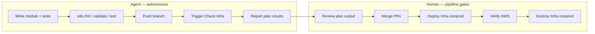
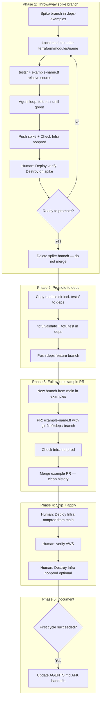

# Local-First Terraform Module Development

**Date:** 2026-07-31  
**Generated by:** Composer

Strategy for prototyping Terraform modules in this repo, promoting them to [deps](../deps), and validating them through CI before human-gated apply.

**Key rules:**

- The deps-examples **spike branch** (Phase 1: local module + relative `source`) is **throwaway** — never merged, never PR'd to `main`. Delete it when promotion to deps is done; keeping spike history in examples is not a goal.
- For **significant modules**, push the spike branch and run a **full nonprod smoke test** (Check Infra → human Deploy → verify → Destroy) before promoting to deps. Local-only spike is fine for trivial or early throwaway experiments.
- Module code and tests land in **deps** (merged PR there).
- A **follow-on branch and PR** in examples (Phase 3) adds only git-pinned `example-*.tf` files — a small, reviewable changeset with no development noise on `main`.

**Module-specific plans:** see [PLAN-bedrock-inference-module.md](PLAN-bedrock-inference-module.md) for the first module (`bedrock_inference`).

---

## Implementation checklist (generic)

- [ ] **Phase 1:** Throwaway spike branch; `terraform/modules/<name>/` + `tests/` + relative `example-<name>.tf` in **nonprod only**; `tofu test` green; **push spike**; Check Infra nonprod; **human Deploy → verify → Destroy** on spike; delete spike — never merge
- [ ] **Phase 2:** Copy module directory (including tests) to `deps/terraform/modules/<name>/`; `fmt`, `validate`, `test`; push deps feature branch
- [ ] **Phase 3:** Follow-on examples branch from `main` + PR: git `?ref=<deps-branch>` and `example-<name>.tf` only; Check Infra nonprod; merge PR (clean history — no spike commits)
- [ ] **Phase 4:** Merge deps PR → `main`; merge examples integration PR → `main`; human runs Deploy Infra nonprod (optional Destroy)
- [ ] **Phase 5:** After first successful cycle, update [AGENTS.md](../AGENTS.md) and [deps/AGENTS.md](../deps/AGENTS.md) with local-first workflow and AFK agent handoffs

---

## Verdict: workflow is reasonable

The two-repo split is already designed for this:

- **[deps](../deps)** — library code only (no backend, no apply). [AGENTS.md](../deps/AGENTS.md) limits local testing to `tofu validate`.
- **deps-examples** (this repo) — deployable root stacks with AWS backend, nonprod/prod envs, and six manual GitHub Actions workflows.

Starting in examples for a tight local loop is not documented today, but it fits the repo layout and avoids a cross-repo push on every iteration. The placeholder [terraform/modules/.gitkeep](../terraform/modules/.gitkeep) suggests this was anticipated.

The established workflow (deps branch pin → Check Infra on a feature branch) remains the right path for CI integration and promotion — already exercised for DNS env-suffix work (commits `b671823` → `e6cbcff`).

---

## AFK agent workflow vs human pipeline gates

This plan mirrors application-development CI: **automate everything that does not mutate production state**, and **gate apply behind a pipeline the human triggers**.



### What the agent can run without you (AFK-safe)

| Step | Command / action | Mutates AWS? | Needs local creds? |
|------|------------------|--------------|-------------------|
| Format | `tofu fmt -recursive` | No | No |
| Module smoke | `tofu validate` | No | No |
| Interface tests | `tofu test` (plan + mocks) | No | No |
| Push branch | `git push` | No | No |
| CI plan | **Check Infra nonprod/prod** via `gh workflow run` | No (plan only) | No — CI has GitHub env secrets |

The agent inner loop during Phase 1 is **`tofu test` → edit → repeat**. No AWS until interface tests are green.

For **significant modules**, the agent then pushes the spike branch, triggers Check Infra, and hands off for human apply/destroy smoke test (see Phase 1 below). Local-only spike (no push) remains valid for trivial modules or very early experiments.

```bash
gh workflow run check-infra-nonprod.yml --ref <spike-branch>
gh run watch
```

Check Infra runs `tofu plan` against real remote state and AWS — the integration test — without apply.

**Spike smoke test (significant modules, human-gated):** After Check Infra is green on the spike branch, the human runs **Deploy Infra nonprod** → verifies resources in AWS → **Destroy Infra nonprod**. Spike branches write to the same nonprod state as `main`; that is acceptable because nonprod is ephemeral and Destroy tears down the smoke-test resources. Do not merge the spike branch.

**Optional:** Local `tofu plan` in nonprod if the agent environment has AWS creds. Not required for AFK; CI plan is the canonical integration check per [AGENTS.md](../AGENTS.md).

### What stays human-gated (pipeline apply)

| Step | Workflow | When | Why human |
|------|----------|------|-----------|
| Apply nonprod (spike smoke) | **Deploy Infra nonprod** | Phase 1, from spike branch | Creates/modifies AWS resources; validates module before deps promotion |
| Tear down nonprod (spike smoke) | **Destroy Infra nonprod** | After spike deploy verification | Cleans up smoke-test resources |
| Apply nonprod (post-merge) | **Deploy Infra nonprod** | Phase 4, from `main` | Validates git-pinned example after merge |
| Apply prod | **Deploy Infra prod** | After merge to `main` | Long-lived prod resources |
| PR merge | GitHub review | Before deploy | Code review gate |

Deploy runs plan then apply in one job ([deploy-infra-nonprod.yml](../.github/workflows/deploy-infra-nonprod.yml)).

**Agent stops and hands off** with: spike branch pushed, Check Infra green, plan summary attached — then human runs Deploy/Destroy smoke test on the spike before Phase 2 promotion.

### Feedback loop mapping (app dev → infra)

| App development | This workflow |
|-----------------|---------------|
| Unit tests | `tofu test` with mocks in `tests/` |
| Lint / typecheck | `tofu fmt --check`, `tofu validate` |
| CI integration tests | Check Infra (plan only, feature branch) |
| Staging deploy | Deploy Infra nonprod (human-triggered, from `main`) |
| Prod deploy | Deploy Infra prod (human-triggered, from `main`) |

### Future CI enhancement (optional, post-validation)

After the first module cycle, consider adding `tofu test` in Check workflows for changed module directories. Not required for Phase 1.

---

## Recommended workflow (local spike → promote → CI)



### Phase 1 — Throwaway spike branch (examples repo, never merged)

**Goal:** Fast local iteration without pushing to deps. This branch is **disposable** — do not open a PR to `main`.

1. Create a spike branch in deps-examples (naming e.g. `spike/<module-name>` makes intent clear).
2. Add the module under `terraform/modules/<name>/` using the same layout as deps:
   - `main.tf` — variables (and some outputs)
   - `<name>.tf` — resources and outputs
   - `tests/*.tftest.hcl` — interface contract tests
   - Follow existing conventions: `env`, `env-suffix`, `repo` wired from `module.config`; apply suffix internally (see [deps bucket module](../deps/terraform/modules/bucket/)).
3. Add `example-<name>.tf` with relative source on the spike branch in **`terraform/nonprod/` only** (required for stack-level plan and smoke test). Do **not** add prod consumer wiring during the spike — prod is ephemeral examples-repo surface area and gets the git-pinned example in Phase 3 alongside nonprod. Spike example files are **not** what merges to `main` — the follow-on example PR (Phase 3) adds fresh git-pinned files in both envs instead.

```hcl
module "example_foo" {
  source = "../modules/foo"
  env-suffix = module.config.env-suffix
  env        = module.config.env
  repo       = module.config.repo
}
```

4. Develop tests inside the module directory (lift with the module at promotion):

```
terraform/modules/<name>/
├── main.tf
├── <name>.tf
└── tests/
    └── <name>.tftest.hcl
```

5. Agent inner loop (no AWS):

```bash
cd terraform/modules/<name>
tofu fmt -recursive .
tofu init -backend=false
tofu test
```

6. Push spike branch; trigger **Check Infra nonprod** on the spike branch. Still do not merge or open a PR to `main`.

7. **Human smoke test (standard for significant modules):** Run **Deploy Infra nonprod** from the spike branch → verify resources in AWS. For bedrock_inference, run `bun smoke.ts` in `terraform/nonprod/test/e2e/` (OpenRouter-style e2e) and/or Pi/curl → run **Destroy Infra nonprod**. Only promote to deps after this passes.

8. Delete the spike branch (local and remote). Module code copies to deps in Phase 2; spike commits never land on `main`.

### Phase 2 — Promote to deps (module + tests together)

1. Copy the entire `terraform/modules/<name>/` directory to `deps/terraform/modules/<name>/` (including `tests/`).
2. In deps: `tofu fmt -recursive terraform/` and per-module validate + test.
3. Push a feature branch in deps.

Nothing from the spike branch merges to examples `main`. Module code and tests live in deps from here on.

### Phase 3 — Follow-on example branch and PR (mergeable)

**Goal:** A **fresh branch from `main`** and a **focused PR** that only adds consumer wiring. This is what appears in examples history — not the spike.

1. After deps module is ready (deps feature branch open or merged), branch from current `main` in deps-examples.
2. Open a PR whose diff is essentially: git-pinned `example-<name>.tf` in nonprod and prod (plus any stack outputs). No `terraform/modules/` directory.

```hcl
module "example_foo" {
  source = "git::https://github.com/agent-0028/deps.git//terraform/modules/foo?ref=<deps-branch>"

  env-suffix = module.config.env-suffix
  env        = module.config.env
  repo       = module.config.repo
}
```

3. Pin to deps feature branch during review; switch pin to `?ref=main` before or as part of merge once deps is on `main`.
4. Run Check Infra nonprod on the PR branch.
5. Merge the example PR.

Examples `main` history should read like a normal consumer change (“add example for bedrock_inference”), not a module development arc.

### Phase 4 — Ship and apply

1. Merge deps PR → `main`.
2. Ensure examples integration branch uses `?ref=main` for deps (revert temporary branch pin if still present).
3. Merge examples example PR → `main`.
4. Human: Deploy Infra nonprod, verify AWS, optional Destroy.
5. Human (when ready): Deploy Infra prod.

### Phase 5 — Document (after first successful cycle)

Update [AGENTS.md](../AGENTS.md) and [deps/AGENTS.md](../deps/AGENTS.md) with local-first workflow and AFK agent vs human pipeline handoffs. Do not update prematurely.

---

## Testing layers

| Layer | Where | Command | Agent AFK? | Mutates AWS? |
|-------|-------|---------|------------|--------------|
| Interface contract | `terraform/modules/<name>/tests/` | `tofu test` | Yes | No |
| Stack plan (CI) | spike or feature branch | Check Infra | Yes | No |
| Stack apply (spike smoke) | spike branch | Deploy Infra nonprod | No — human | Yes |
| Live invoke smoke | `terraform/nonprod/test/e2e/` (bedrock example) | `bun smoke.ts` after Deploy | No — human | Yes (inference cost) |
| Stack teardown (spike smoke) | spike branch | Destroy Infra nonprod | No — human | Yes |
| Stack apply (post-merge) | `main` | Deploy Infra | No — human | Yes |
| Teardown (post-merge) | `main` | Destroy Infra nonprod | No — human | Yes |

---

## Caveats

1. **Spike never merges** — no `terraform/modules/` or relative sources on `main`. Push spike for smoke test, then delete it; remote spike branches are disposable, not archived history.
2. **Spike smoke test is standard** — for significant modules, human runs Deploy → verify → Destroy on the spike branch before deps promotion. Spike deploy uses shared nonprod state; Destroy cleans up.
3. **Follow-on example PR only** — what merges to examples `main` is a small PR adding git-pinned `example-*.tf`. Branch fresh from `main`, not from spike.
4. **Two repos, two merge stories** — deps PR merges module code; examples PR merges consumer wiring only.
5. **Nonprod only during Phase 1 spike** — relative `example-*.tf` lives under `terraform/nonprod/` until promotion. Phase 3 follow-on PR adds matching git-pinned `example-*.tf` in **both** nonprod and prod.
6. Agents must not run Deploy/Destroy or local `tofu apply`/`tofu destroy`.

---

## Alternative: deps-first

If a module is a straightforward variant of an existing pattern, develop in deps with branch pins from the start. Use local-first when API/design is still moving.
